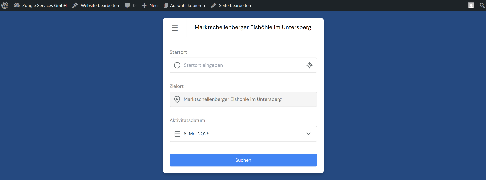

# WP Diana Widget




* **Contributors:** Simon Heppner
* **Tags:** wordpress, gutenberg, block, widget, transit, planning, diana, activity, schedule, travel
* **Requires at least:** unkown, but should be 6.7.0
* **Tested with:** 6.8.1
* **Requires PHP:** 7.4
* **License:** GPL-2.0-or-later
* **License URI:** https://www.gnu.org/licenses/gpl-2.0.html
* **Plugin URI:** https://www.zuugle-services.com

WP Diana Widget is a WordPress plugin that provides a Gutenberg block to seamlessly integrate the powerful [DianaWidget Activity Transit Planner](https://github.com/zuugle-services/DianaWidget) into your WordPress pages and posts. It allows users to plan public transport to and from activities with specific time constraints like start times, end times, and duration.

## Description

This plugin acts as a wrapper for the [DianaWidget](https://github.com/zuugle-services/DianaWidget), a sophisticated JavaScript library designed for activity-based transit planning. By using the "Diana Activity Widget" block, you can easily embed this functionality into your content, allowing your site visitors to:

* Find transit connections to a predefined activity.
* Specify their starting location with autocomplete suggestions.
* Select a date for their travel using an adaptive calendar.
* View connection results with clear timelines and transport modes.

The plugin handles secure API authentication with Zuugle Services by allowing administrators to store Client ID and Client Secret in WordPress settings. These credentials are then used server-side to fetch an API token, which is passed to the widget. Each block instance can be configured with unique activity details directly within the WordPress editor.

## Features

* **Gutenberg Block Integration:** Easily add the Diana Widget to any page or post using a dedicated block.
* **Secure API Credential Management:** Store your Zuugle Services Client ID and Client Secret securely in WordPress settings. API tokens are fetched and handled server-side.
* **Customizable Activity Parameters:** For each block instance, you can configure:
	* Activity Name and Type
	* Start and End Locations (coordinates or address)
	* Display Names for locations
	* Earliest and Latest Start/End Times for the activity
	* Activity Duration
	* Timezone and Language
	* Custom labels for start/end times
* **Dynamic Widget Loading:** The widget script is loaded from the official CDN.
* **Multiple Widget Instances:** Supports multiple Diana Widget blocks on a single page, each with its own configuration.
* **Responsive Design:** Leverages the responsive capabilities of the core DianaWidget.

## Installation

1.  **Download:** Download the plugin ZIP file from the latest release, or optionally a past version.
2.  **Upload:** In your WordPress admin panel, go to `Plugins` > `Add New` > `Upload Plugin`. Choose the ZIP file and click `Install Now`.
3.  **Activate:** Activate the plugin through the `Plugins` menu in WordPress.
4.  **Configure Credentials:**
	* Navigate to `Settings` > `Diana Widget` in your WordPress admin area.
	* Enter your `Client ID` and `Client Secret` provided by Zuugle Services.
	* Save the settings.

## How to Use

1.  **Add the Block:**
	* Open a page or post in the WordPress block editor.
	* Click the `+` icon to add a new block.
	* Search for "Diana Activity Widget" and select it.
2.  **Configure the Block:**
	* With the block selected, use the Inspector Controls (sidebar on the right) to set the specific details for the activity you want users to plan travel to. This includes activity name, location, times, duration, etc.
3.  **Save and View:** Save your page/post. The Diana Widget will appear on the frontend, configured with the details you provided.

## Programmatic Usage

You can also render the Diana Activity Widget block programmatically within your PHP code (e.g., in your theme's `functions.php`, a custom plugin, or a template file) using WordPress's `do_blocks()` function. This is useful if you need to embed the widget in locations not directly editable with the block editor.

There's an example helper function `get_diana_widget_html()` that you can use to generate the HTML for the widget. This function takes an array of attributes and returns the HTML for the Diana Widget block.
See [Sample do_blocks() Script](./sample-do-blocks.php) for a complete example.

**Example of how to use this function:**

```php
<?php
// Define the attributes for your widget instance
$my_widget_attributes = [
    'activityName'                     => 'Marktschellenberger Eishöhle im Untersberg',
    'activityType'                     => 'Hiking',
    'activityStartLocation'            => '47.72620173410345, 13.042174020936743',
    'activityStartLocationType'        => 'coordinates',
    'activityStartLocationDisplayName' => 'Untersbergbahn Talstation',
    'activityEndLocation'              => '47.70487271915757, 13.038710343883247',
    'activityEndLocationType'          => 'coordinates',
    'activityEndLocationDisplayName'   => 'Eishöhle, Marktschellenberg',
    'activityEarliestStartTime'        => '08:00:00',
    'activityLatestStartTime'		   => '14:00:00',
    'activityEarliestEndTime'          => '10:00:00',
    'activityLatestEndTime'            => '20:00:00',
    'activityDurationMinutes'          => '300',
    'timezone'                         => 'Europe/Vienna',
    'language'                         => 'EN',
    'containerMaxHeight'               => '650px',
    // ClientID and ClientSecret are typically managed by the plugin's settings page.
    // Only include them here if you need to override for a specific instance and
    // your render.php logic supports attribute-based credential overrides.
    // 'clientID' => 'your_client_id_override',
    // 'clientSecret' => 'your_client_secret_override',
];

// Get the HTML for the block
$diana_widget_html = get_diana_widget_html( $my_widget_attributes );

// Output the HTML (e.g., in a template file or via a shortcode)
// Make sure to properly escape if necessary, though do_blocks should return safe HTML.
echo $diana_widget_html;
?>
```

## About the DianaWidget JavaScript Library

The core functionality is provided by the `DianaWidget`, a standalone JavaScript library. For more detailed information about the widget's features, its own configuration options (which this plugin exposes), styling, and architecture, please refer to its GitHub repository:
[https://github.com/zuugle-services/DianaWidget](https://github.com/zuugle-services/DianaWidget)

## Changelog

**1.0.0**
* Initial release with Gutenberg block.
* Settings page for API Client ID and Secret.
* Server-side API token fetching and caching.
* Comprehensive block attributes for widget configuration.
* Support for multiple widget instances.

## Frequently Asked Questions

* **Where do I get a Client ID and Client Secret?**
  You need to apply for access and obtain these credentials from [Zuugle Services](https://www.zuugle-services.com) as described in the [DianaWidget security process](https://github.com/zuugle-services/DianaWidget#apply-for-access--security-process).

* **Can I customize the appearance of the widget?**
  The DianaWidget itself supports theming via CSS custom properties. You can add custom CSS to your WordPress theme to override these variables. See the [DianaWidget styling documentation](https://github.com/zuugle-services/DianaWidget#styling--theming) for more details. This plugin also provides a "Widget Container Max Height" setting in the block editor.

---

> This WordPress plugin helps bridge the gap between the powerful DianaWidget library and your WordPress website, making complex transit planning accessible to your users.
